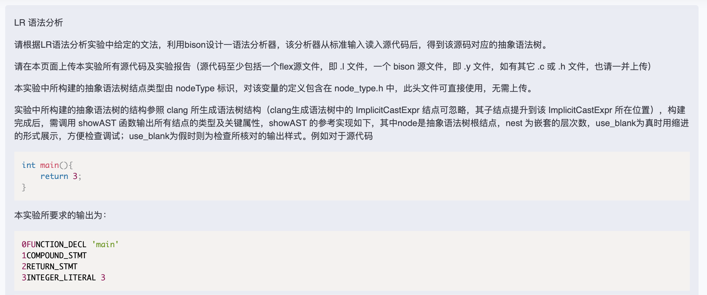

# Experiment 3

## Question

LR 语法分析

请根据LR语法分析实验中给定的文法，利用bison设计一语法分析器，该分析器从标准输入读入源代码后，得到该源码对应的抽象语法树。

请在本页面上传本实验所有源代码及实验报告（源代码至少包括一个flex源文件，即 .l 文件，一个 bison 源文件，即 .y 文件，如有其它 .c 或 .h 文件，也请一并上传）

本实验中所构建的抽象语法树结点类型由 nodeType 标识，对该变量的定义包含在 node_type.h 中，此头文件可直接使用，无需上传。

实验中所构建的抽象语法树的结构参照 clang 所生成语法树结构（clang生成语法树中的 ImplicitCastExpr 结点可忽略，其子结点提升到该 ImplicitCastExpr 所在位置），构建完成后，需调用 showAST 函数输出所有结点的类型及关键属性，showAST 的参考实现如下，其中node是抽象语法树根结点，nest 为嵌套的层次数，use_blank为真时用缩进的形式展示，方便检查调试；use_blank为假时则为检查所核对的输出样式。例如对于源代码

```c
int main(){
    return 3;
}
```

本实验所要求的输出为：

```sh
0FUNCTION_DECL 'main'
1COMPOUND_STMT
2RETURN_STMT
3INTEGER_LITERAL 3
```



## Note

### 头文件引用关系：

node_type.h >> ast.h >> ast.tab.h

### bison

* `%code requires {}` 用于声明在解析器生成前必须包含的代码，通常是头文件的引用或前置声明。这部分代码会被放置在 Bison 自动生成的头文件中，确保其他文件或模块在包含这个头文件时也能获得这些定义
* `%{ %}` 用于包含需要嵌入在生成的解析器中的 C/C++ 代码。这部分代码通常被插入到生成的 .c 或 .cpp 文件的最前面
* 生成的 c 文件会自动引用 bison 生成的 h 文件

### 英文缩写

* AST: Abstract Syntax Tree - 抽象语法树
* Decl: Declaration - 声明
* Stmt: Statement - 语句
* Expr: Expression - 表达式
* Ref: Reference - 引用
* Para: Parameter - 参数
* Func: Function - 函数
* Var: Variable - 变量
* Rel: Relation - 关系

### 递归下降函数

包括

1. 创建节点的函数，即 NewXXX 函数
2. 解析语句的函数，即 rd_xxx 函数

### 注

语法分析就是逐步规约的过程。

大括号外的文法规则只是定义规约的规则，相当于定义变量，没有动作实现。大括号内才是实际要执行的动作（完全需要我们自己写）。

我们要做的是写出递归下降函数来计算终结符/非终结符的综合属性（如节点）和继承属性。

所以 bison 实际只是给出了一个文法规则的简便声明的方法，实际的规约动作还是需要我们自己实现。

***

注：此实验未完成。example 中的代码为实例代码，可以通过 iCoding 测试。
